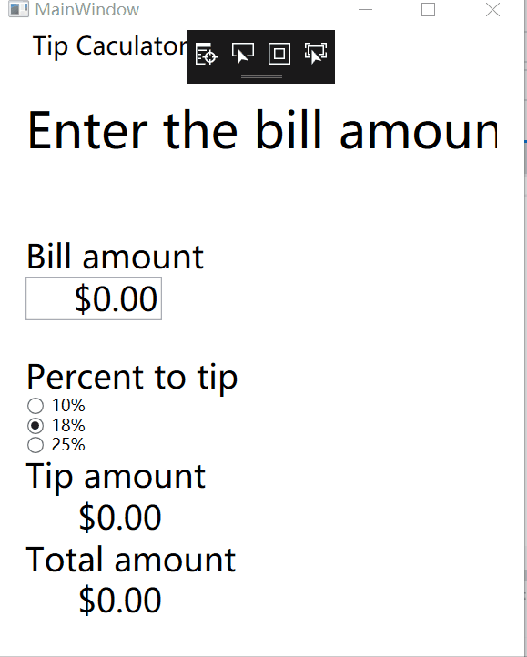

# homework03
C# homework03, by Lu Yuan, April 3rd, 2019

## Introduction
1. this WPF app is to calculate tip during a meal, the details is almost same with the android app in the movie
2. use yuan instead of dollars, which made it can be used in China

## change log
#### first version(f95ff13), released in 11:14, April 3rd, 2019
1. beautify the layout of original app
2. fix the bug when changing tip percent tags the totalAmount will clear to 0
3. screencut 

#### second version(5dba278), released in 11:09, April 3rd, 2019
1. try to build an universal app in window and android but failed (the project has been deleted)
2. beautify the layout of window app
